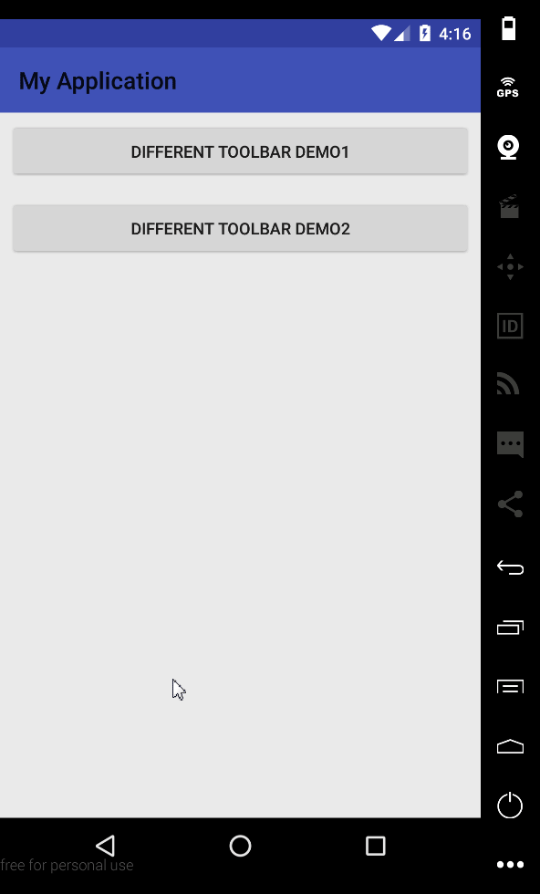

如何给一个Activity中的Fragment设置不同的ActionBar?

这个项目给出了实现，参考自[How to use different toolbar for different fragments in a single activity in android?](https://stackoverflow.com/questions/39909716/how-to-use-different-toolbar-for-different-fragments-in-a-single-activity-in-and)和[Different toolbar for fragments and Navigation Drawer](https://stackoverflow.com/questions/35015182/different-toolbar-for-fragments-and-navigation-drawer)这两篇帖子

截图如下:

